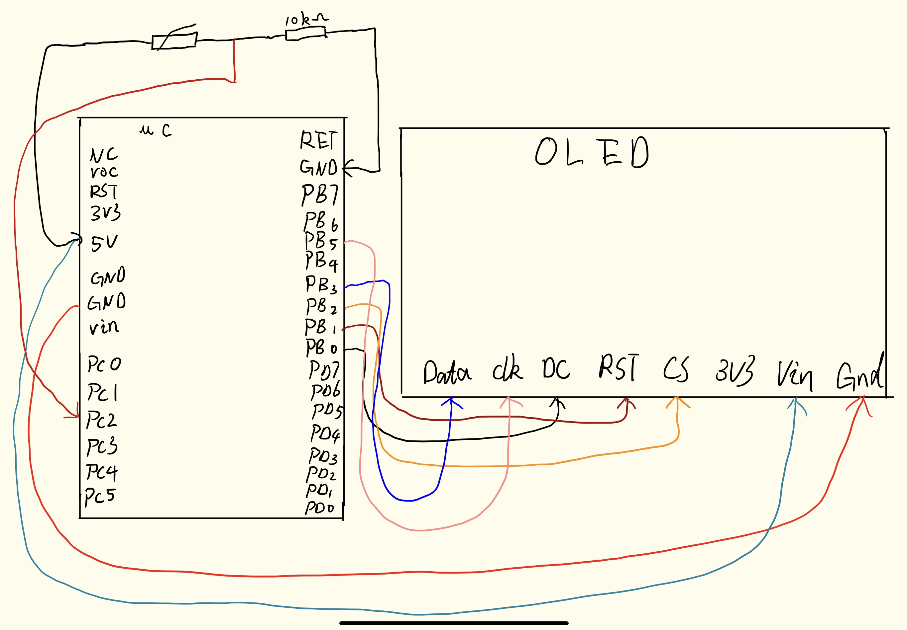

# Organization of Computer Systems Final Project
American University

Author: Zijie Yu

## Motivation
Many people especially programmer don't care about the room's temeperater( most programmer only care about the code). But temeperater is imprtant for everyone. If the weather is cold, people should wear more clothes. If the weather is hot, people should drink more water. So, I made temeperater reminder, to remind people do what they should do. If they follow my temperature reminder, they will keep healthy.

## Description
For my final project, I have built temeperater reminder in AVR Assembly. It uses the ATMega328PB Xplained development board and the Sparkfun Breakout Proto board as its base.

My idea basically is when the temperature is **less than comfort temperature**, the OLED will reminds people to wear more warm clothes. If the temperature is **comfort temperature around**, the OLED will show "Perfect". Else, the OLED will show "Too hot"
By the way, I called this product "**Temperater reminder**"

Input: Thermisitor MF52A202J3470 (Temperater sensor)
Output: Adafruit SSD1306 OLED screen breakout board

## Flowchart

## Hardware Schematic

## Pseudocode Code

